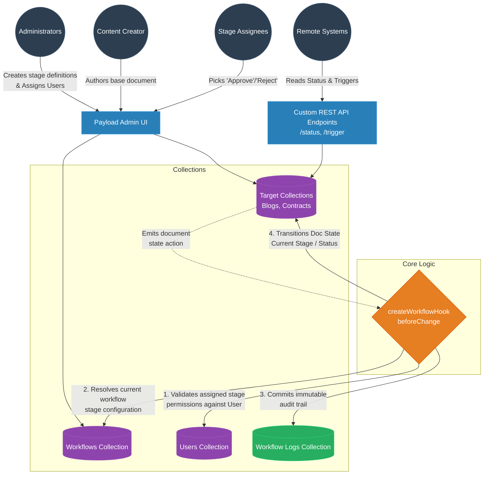

# High-Level Diagram (HLD) for Dynamic Workflow Management System

## 1. Architecture Overview

The Payload CMS Dynamic Workflow Management System allows administrators to define customizable, multi-stage approval processes and attach them to any data collection (e.g., Blogs, Contracts). The system leverages Payload's hooks API (`beforeChange`), custom REST endpoints, and collection relationships to ensure proper auditing, authorization at each stage, and flexible state tracking.

### System Components:
1. **Payload Admin UI / APIs:** The entry point for users to interact with workflow configurations, submit documents, and trigger state changes via explicit actions (Approve, Reject).
2. **Configuration Collections:** Handles configuration data, consisting of workflows and their designated authorization stages.
3. **Core Logic (Hook):** A generic `createWorkflowHook` utility acts as the central orchestrator routing state changes, managing role-based access control (RBAC), and generating audit trails.
4. **Target Collections:** The operational records (like Blogs and Contracts) transitioning through varying lifecycle states.
5. **Auditing (`WorkflowLogs`):** An append-only historical record of each progression or rejection.

---

## 2. Architecture Diagram

---

## 3. High-Level Explanations

### 3.1. Collections Structure

* **Workflows Collection (`Workflows.ts`)**
  Maintains exactly how a specific workflow behaves. Contains an array of `stages`. Each stage designates a specific approval phase (e.g., "Legal Review") and holds an `assignedTo` relationship linking to a Payload User ID.
* **Target Collections (`Blogs.ts`, `Contracts.ts`)**
  Standard internal entities enhanced with workflow bindings. Their fields contain a relationship back to the active `workflow` and the track of the `currentStage` index. They operate using a virtual `action` field dropdown to dictate their next logical transition (`approve`, `reject`, `none`).
* **Workflow Logs Collection (`WorkflowLogs.ts`)**
  An independent collection dedicated to logging actions securely. Keeps an immutable record of when changes occurred, the specific document altered, its context, and the type of workflow action taken. Used for extensive auditing requirements.

### 3.2. Core Logic (`workflowHook.ts`)

Operating via the Payload CMS `beforeChange` hook API, this orchestrator seamlessly monitors updates to any attached Target Collection documents.

**The hook systematically processes updates in the following order:**
1. **Escape Clause:** Exists early if the modified document's `action` field is "none" or undefined.
2. **Context Resolution:** Queries the target workflow to determine the total length of stages.
3. **Authorization Check (RBAC):** Retrieves the `assignedTo` user mapped to the currently focused stage. It throws an immediate authorization error if the current Payload user does not align with the strict assignee specified by the config.
4. **Audit Generation:** Directly injects a tracking entity row into `WorkflowLogs` with the current date timestamp and exact action details.
5. **State Machine Transitions:**
   * If `action === 'reject'`: Halts progression, updates document `status` to `rejected`, and clears upcoming action requirements. Logs a rejection notification.
   * If `action === 'approve'`: Increments the numerical `currentStage` counter. If the maximum stage length is surpassed, marks the document as fully `approved`. Otherwise, routes an email notification output towards the *next* designated user in the sequential queue.

### 3.3. Custom API Logic

Dedicated REST endpoints are exposed to provide direct programmability and external queryability for the connected documents without relying strictly on the generic Admin interface.

* **GET `/:docId/status`** — Resolves deeper context by cross-referencing collections (like pulling names dynamically from stages) to emit a clean payload covering total stages, user allocations, and real-time document status.
* **POST `/trigger`** — Hardcodes the initialization of a workflow sequence, immediately moving a document from unstructured drafting into stage `0` (pending mode) of the requested workflow ID.
